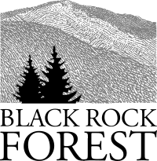

---
header-includes:
  - \usepackage{floatrow}
title: "Home"
output:
  html_document:
    css: home.css
---

<style type="text/css">
  h1 { font-family: Arial; font-size: 18pt; }
  h2 { font-family: Arial; font-size: 11pt; line-height: 1;}
  body { font-family: Arial; font-size: 12pt; }
</style>

<div class="image-container">
  
</div>

<style>
.full-width body {background-color: #f3f3f3; 
                       max-width: 100vw;
                       margin: auto;
                       }
</style>


---

<div text style= "float:right; position: relative">

```{r headshot, echo = F, out.width = "40%", out.extra='style="float:right; padding:10px"'}
knitr::include_graphics("C:/Users/jwall/Documents/GitHub_jlwall/jlwall/Wall_Denali2.JPG")
```


# Jennifer L. Wall, PhD

## *Postdoctoral Research Fellow*

## Black Rock Forest & Lamont-Doherty Earth Observatory, Columbia University

<br>

I am a wildlife biologist broadly interested in population and community ecology, theoretical and applied modeling, and behavioral ecology. More specifically, I am interested in better understanding how climate and other anthropogenic changes impact species interactions and behavior at the intersection of both applied and theoretical ecology.

I have about 10 years of research experience on a variety of taxa and systems, including planning and implementing a multi-year, collaborative research project assessing the impacts of climate and landcover changes on at-risk wildlife in Alaska. I am currently a Postdoctoral Research Fellow with [Black Rock Forest](https://www.blackrockforest.org/) and the [Lamont-Doherty Earth Observatory](https://lamont.columbia.edu/), where I am building on existing research efforts to understand mammal composition and landscape use in the Hudson Valley. 

</div>

---

# Recent Updates

*Coming soon:* I will be leading a workshop on [Denali's alpine wildlife](akgeo.org/activities/denalis-alpine-wildlife/) with AK Geographic in Denali National Park and Preserve July 17 - 19th. 


January 2026
 
  : Check out our article on bobcat movement ecology in [Black Rock Forest's 2026 Winter newsletter](https://www.blackrockforest.org/wp-content/uploads/2026/01/2026_winter_newsletter_web.pdf) (Page 2).


October 2025
  
  : Published a photo of juvenile timber rattlesnakes (*Crotalus horridus*) in [Black Rock Forest's 2025 Fall newsletter](https://www.blackrockforest.org/wp-content/uploads/2025/10/2025_fall_newsletter_v6.pdf) (Page 3).


July 2025

  : Check out [Black Rock Forest's blog post](http://www.blackrockforest.org/blog/our-postdoctoral-fellows) welcoming me as their incoming postdoctoral research fellow and saying goodbye to our outgoing postdoctoral fellow, Dr. Hanna Makowski.

  : Also made an appearance in [Black Rock Forest's 2025 Summer newsletter](https://www.blackrockforest.org/wp-content/uploads/2025/07/2025_summer_newsletter_v5.pdf) (Page 4).


<div style="width:130px; float:left; padding:30px">

</div>

<div style="width:370px; float:left; padding:30px">

</div>